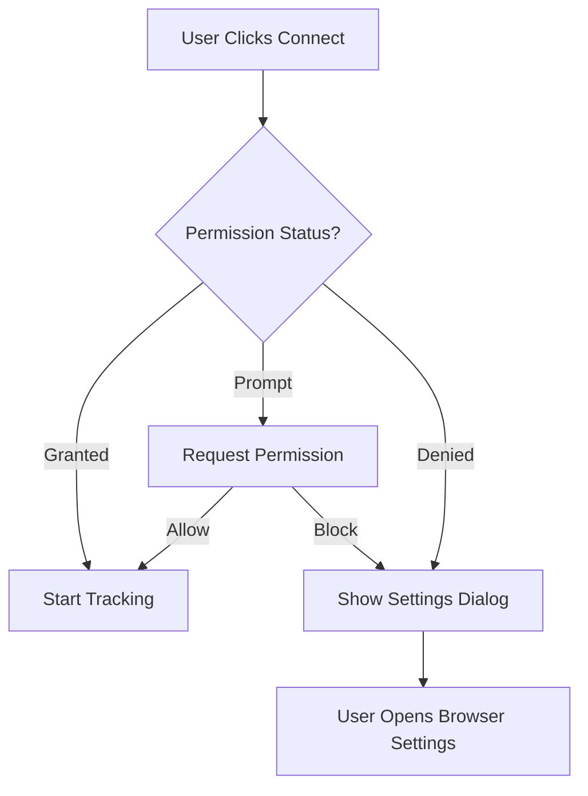

# Real-Time Location Tracking - Spotmate

## Overview

Spotmate now includes production-ready, battery-aware, privacy-respecting real-time location tracking using the HTML5 Geolocation API and Lovable Cloud (Supabase) backend.

## Features

✅ **Foreground & Background Location Updates** (browser capabilities permitting)
✅ **Battery-Aware Throttling** - Updates every 10-20s or 25-50m movement
✅ **Privacy Controls** - Users control when they're visible
✅ **Live UI Indicator** - Shows location status (Live, Paused, No permission, Error)
✅ **High-Accuracy Mode** - Activated during active meetings (5-10s/10m)
✅ **Secure Database** - Row-Level Security policies protect user data
✅ **Realtime Updates** - See nearby users live via Supabase Realtime

## Architecture

```
src/services/location/
  ├── LocationProvider.tsx      # React context provider
  ├── useLocationStream.ts      # Hook for location tracking
  ├── supabaseWriter.ts         # Throttled database writes
  ├── permissions.ts            # Permission handling
  ├── geoutils.ts              # Distance calculations, geohash
  ├── types.ts                 # TypeScript definitions
  └── index.ts                 # Exports
```

## How It Works

### 1. Location Tracking

The system uses `navigator.geolocation.watchPosition()` to continuously monitor user location:

- **Normal Mode**: Updates every 10s or when user moves 25m
- **High-Accuracy Mode**: Updates every 5s or when user moves 10m (during active meetings)
- **Throttled Writes**: Database writes limited to once every 10s minimum, 60s maximum

### 2. Privacy & Security

**Database Security (RLS Policies)**:
- Users can only write to their own location record
- Users with `location_status = 'live'` can see other live users nearby
- Exact coordinates are stored but can be rounded for display

**User Controls**:
- Location tracking only starts when user enables "Connect"
- One-tap toggle to pause/resume
- Clear permission prompts with privacy explanations

### 3. Permission Flow



### 4. Meeting Integration

When a user starts an active meeting:
1. System switches to **high-accuracy mode**
2. Updates become more frequent (5s intervals, 10m threshold)
3. Background tracking continues (browser permitting)
4. When meeting ends, system reverts to normal mode

## Database Schema

```sql
CREATE TABLE user_locations (
  id UUID PRIMARY KEY,
  user_id UUID NOT NULL UNIQUE,
  lat DOUBLE PRECISION NOT NULL,
  lng DOUBLE PRECISION NOT NULL,
  accuracy DOUBLE PRECISION NOT NULL,
  speed DOUBLE PRECISION,
  heading DOUBLE PRECISION,
  geohash TEXT,
  location_status location_status NOT NULL, -- 'live' | 'paused' | 'denied' | 'error'
  updated_at TIMESTAMPTZ NOT NULL,
  created_at TIMESTAMPTZ NOT NULL
);
```

**Indexes**:
- `geohash` - For proximity queries
- `location_status` - Filter by status
- `updated_at` - Sort by recency

**Realtime Enabled**: Yes ✅

## Usage

### Using the Location Context

```tsx
import { useLocation } from '@/services/location';

function MyComponent() {
  const { 
    currentLocation,      // Current coordinates
    locationStatus,       // 'live' | 'paused' | 'denied' | 'error'
    isTracking,          // Boolean
    startTracking,       // Start location updates
    stopTracking,        // Stop location updates
    startHighAccuracySession,  // Enable high-accuracy mode
    stopHighAccuracySession,   // Disable high-accuracy mode
    requestPermission    // Request location permission
  } = useLocation();

  // Example: Toggle tracking
  const handleToggle = async () => {
    if (isTracking) {
      stopTracking();
    } else {
      const permission = await requestPermission();
      if (permission === 'granted') {
        await startTracking();
      }
    }
  };

  return (
    <div>
      <button onClick={handleToggle}>
        {isTracking ? 'Stop' : 'Start'} Tracking
      </button>
      {currentLocation && (
        <p>Lat: {currentLocation.lat}, Lng: {currentLocation.lng}</p>
      )}
    </div>
  );
}
```

### Live Location Pill Component

Add to any page to show location status:

```tsx
import { LiveLocationPill } from '@/components/LiveLocationPill';

<LiveLocationPill />
// Shows: 🟢 Live | ⚪ Paused | 🔴 Error | ⚫ No permission
```

## Testing

### Browser Testing

1. **Grant Permission**:
   - Open DevTools → Console
   - Click the location icon in address bar
   - Select "Allow"

2. **Test Tracking**:
   - Toggle "Connect" on Space page
   - Check LiveLocationPill status
   - Verify database updates in Cloud backend

3. **Test High-Accuracy Mode**:
   - Start an active meeting
   - Observe faster location updates
   - End meeting and verify revert to normal

4. **Test Permission Denial**:
   - Block location in browser settings
   - Try to enable Connect
   - Verify permission dialog appears

### Database Verification

Check location updates in Lovable Cloud:

```sql
SELECT 
  user_id,
  lat,
  lng,
  accuracy,
  location_status,
  updated_at
FROM user_locations
ORDER BY updated_at DESC;
```

### Console Debugging

Enable verbose location logs:

```javascript
// In browser console
localStorage.setItem('DEBUG_LOCATION', 'true');
```

## Battery Optimization

The system includes several battery-saving measures:

1. **Adaptive Sampling**:
   - Stationary users: Updates every 60s
   - Moving users: Updates every 10s or 25m
   
2. **Distance Filtering**:
   - Skips updates if movement < 25m (normal mode)
   - Skips updates if movement < 10m (high-accuracy mode)

3. **Throttled Writes**:
   - Maximum 1 write per 10 seconds
   - Coalesces rapid updates
   - Prevents database overload

4. **Selective High Accuracy**:
   - Only uses high-accuracy GPS during active meetings
   - Reverts to balanced mode otherwise

## Browser Support

| Feature | Chrome | Firefox | Safari | Edge |
|---------|--------|---------|--------|------|
| Geolocation API | ✅ | ✅ | ✅ | ✅ |
| Background Updates | ⚠️ Limited | ⚠️ Limited | ⚠️ Limited | ⚠️ Limited |
| Permission API | ✅ | ✅ | ⚠️ Partial | ✅ |

**Note**: Background location tracking in web browsers is limited. For true background tracking, consider a PWA or native mobile app (Capacitor).

## Privacy Considerations

### What's Stored
- Exact coordinates (lat/lng) - For distance calculations
- Accuracy radius - For quality assessment
- Speed & heading - Optional, for movement detection
- Geohash - For efficient proximity queries

### What's Shared
- **Live users only see other live users**
- Approximate distance, not exact coordinates
- Users control visibility with one tap

### Best Practices
1. Always explain why location is needed
2. Request permission in context (when user enables Connect)
3. Provide easy opt-out (one-tap toggle)
4. Use coarse coordinates for display when possible
5. Clear location data when user logs out

## Troubleshooting

### Location Not Updating

1. Check browser permissions (address bar icon)
2. Verify HTTPS connection (required for geolocation)
3. Check console for errors
4. Ensure user has "Connect" enabled
5. Verify database RLS policies

### High Accuracy Not Working

1. Device may not support high-accuracy GPS
2. User may be indoors (poor GPS signal)
3. Browser may throttle frequent requests
4. Check `accuracy` value in location data

### Permission Denied

1. User must manually enable in browser settings
2. HTTPS is required
3. Some browsers block geolocation in iframes
4. Private/incognito mode may restrict access

## Future Enhancements

- [ ] PWA with Service Worker for true background tracking
- [ ] Capacitor integration for native mobile apps
- [ ] Geofencing for location-based triggers
- [ ] Speed-based adaptive sampling
- [ ] Battery level monitoring
- [ ] Location history visualization
- [ ] Privacy zones (don't track at home/work)

## Technical Details

### Distance Calculation (Haversine Formula)

```typescript
function calculateDistance(lat1, lng1, lat2, lng2) {
  const R = 6371e3; // Earth radius in meters
  const φ1 = lat1 * Math.PI / 180;
  const φ2 = lat2 * Math.PI / 180;
  const Δφ = (lat2 - lat1) * Math.PI / 180;
  const Δλ = (lng2 - lng1) * Math.PI / 180;
  
  const a = Math.sin(Δφ/2) * Math.sin(Δφ/2) +
            Math.cos(φ1) * Math.cos(φ2) *
            Math.sin(Δλ/2) * Math.sin(Δλ/2);
  const c = 2 * Math.atan2(Math.sqrt(a), Math.sqrt(1-a));
  
  return R * c; // meters
}
```

### Geohash Encoding

Geohashes enable efficient proximity queries by encoding coordinates into a string. Nearby locations share common prefixes:

- Precision 7: ~153m x 153m
- Precision 6: ~1.2km x 609m
- Precision 5: ~4.9km x 4.9km

Example: `dr5ru6p` and `dr5ru6q` are adjacent cells.

---

## Questions?

Check the [Lovable Cloud docs](https://docs.lovable.dev/features/cloud) or ask in the Lovable Discord community.
